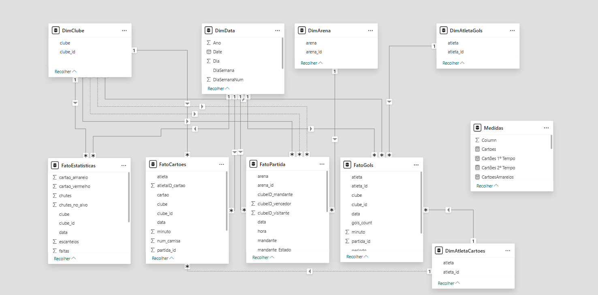
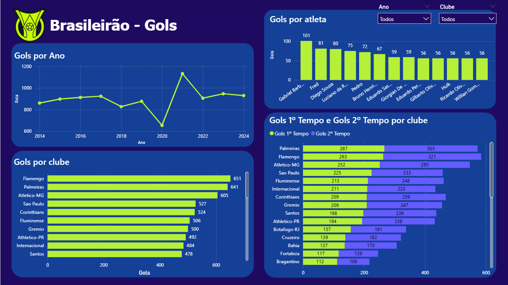
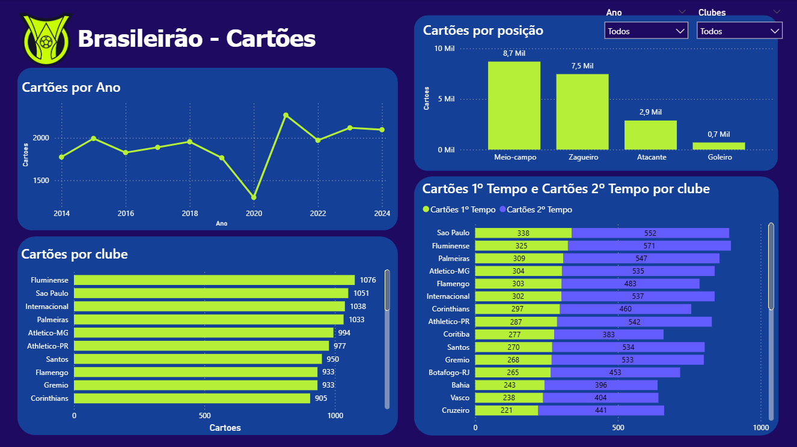
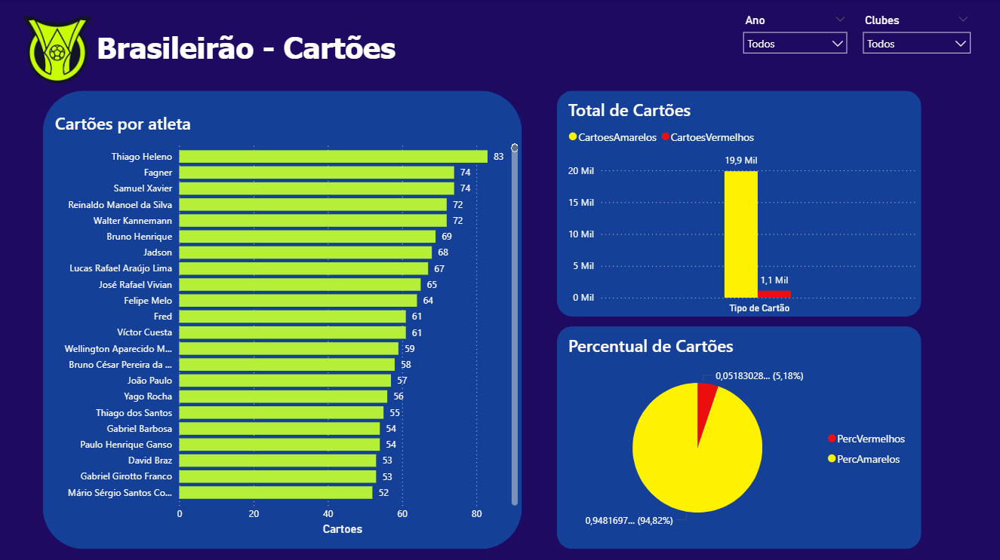
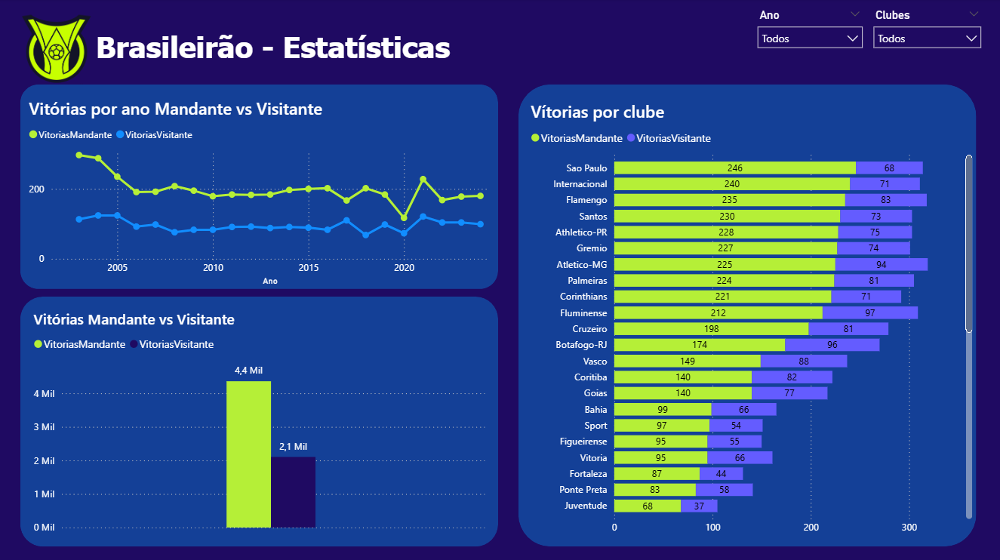
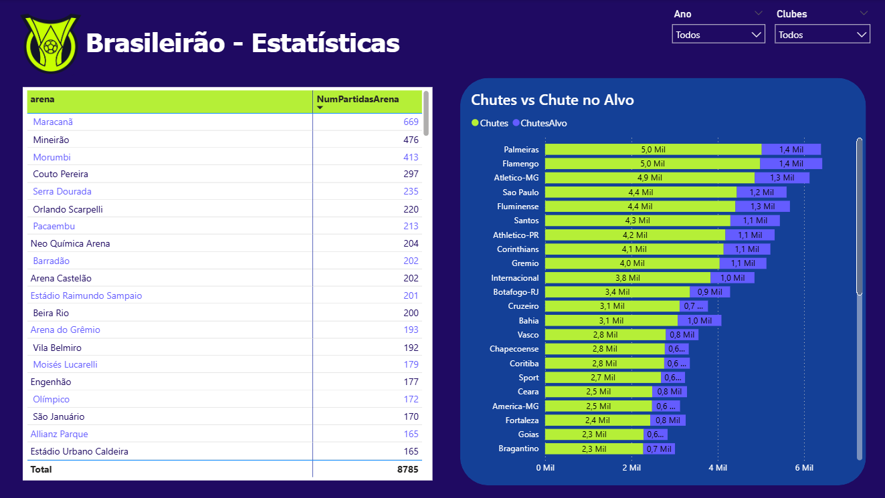
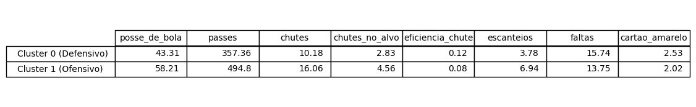
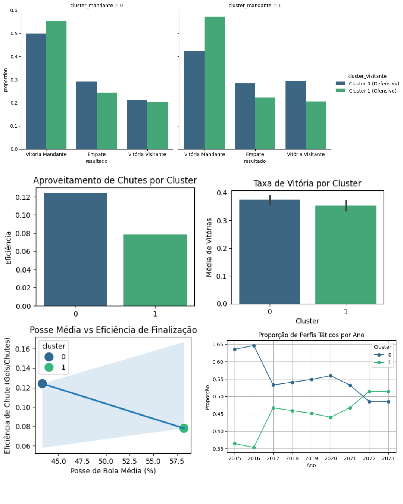

# ⚽ Análise do Campeonato Brasileiro de Futebol ao longo dos anos
Nesse repositório se encontram o Trabalho Prático I da disciplina, que se refere ao PowerBI dos dados do Brasileirão e o Trabalho Prático II que se refere a mineração dos dados, sobretudo da clusterização dos times do campeonato brasileiro.

Fonte dos Dados: https://www.kaggle.com/datasets/adaoduque/campeonato-brasileiro-de-futebol

---

## Análise Gráfica dos Dados do Campeonato Brasileiro de Futebol
O objetivo do TPI era de realizar a modelagem multidimensional dos dados e apresentar análises e insights com ferramentas de Business Intelligence, a ferramenta escolhida foi o Power BI e abaixo podem ser encontradas nas imagens os gráficos e tabelas gerados a partir dos dados.

A primeira coisa a ser feita foi a modelagem multidimensional, na qual escolhi a constelação de fatos. Constelação de Fatos porque os dados do Brasileirão possuem diferentes granularidades partidas, estatísticas por clube, gols e cartões e unificar tudo em uma única tabela fato causaria duplicações, inconsistências e perda de precisão analítica.

- Modelagem:
    

    
    

Posteriormente a modelagem foram criadas as sheets com as análises gráficas dos dados, como mostrado abaixo:

- Gols:
    

    
    

- Cartões:
    

    
    

- Cartões:
    

    
    

- Estatísticas Gerais:
    

    
    

- Estatísticas Gerais:
    

    
    

## Mineração dos Dados utilizando Clusterização
O objetivo do TPII era realizar a mineração dos dados com algum algoritmo de Machine Learning. Para este trabalho, foi escolhido realizar a clusterização dos times brasileiros para identificar perfis táticos e estilos de jogo dos times defensivos e ofensivos do Brasileirão. Você encontra o notebook referente a clusterização no diretório de [Trabalho Prático II - ML](./Trabalho%20Prático%20II%20-%20ML)

Para a clusterização as features utilizadas foram: `posse de bola`, `passes`, `chutes`, `chutes no alvo`, `cartões`, `faltas`, `escanteios` e também criei uma métrica nova, a `eficiência do chute`.

A clusterização separou os times em dois perfis bem definidos:

- Cluster 0 (Defensivo): menos posse, menos volume ofensivo
- Cluster 1 (Ofensivo): mais posse, mais passes e mais finalizações

Os valores médios de cada uma das features para cada um dos clusters pode ser observado na tabela abaixo:
    

    
    

Pode-se observar na imagem com alguns gráficos abaixo que os resultados mostraram que times defensivos tendem a ser mais eficientes nas finalizações, indicando que maior volume de jogo não garante conversão em gols. Além disso, observou-se que maior posse de bola não está necessariamente relacionada a maior efetividade ofensiva. Outro ponto relevante é que os times do perfil defensivo apresentaram, em média, maior taxa de vitória e também maior incidência de empates, sugerindo um estilo de jogo mais controlado e estratégico. Nos confrontos entre estilos, partidas entre times defensivos tendem a ser mais equilibradas, enquanto jogos entre times ofensivos apresentam maior variabilidade de resultados. Por fim, ao longo dos anos analisados, percebe-se uma tendência de aumento no número de equipes com perfil ofensivo, refletindo a evolução do futebol moderno, embora os dados indiquem que eficiência e estratégia ainda podem ser mais determinantes que volume de jogo.

  

    
  

